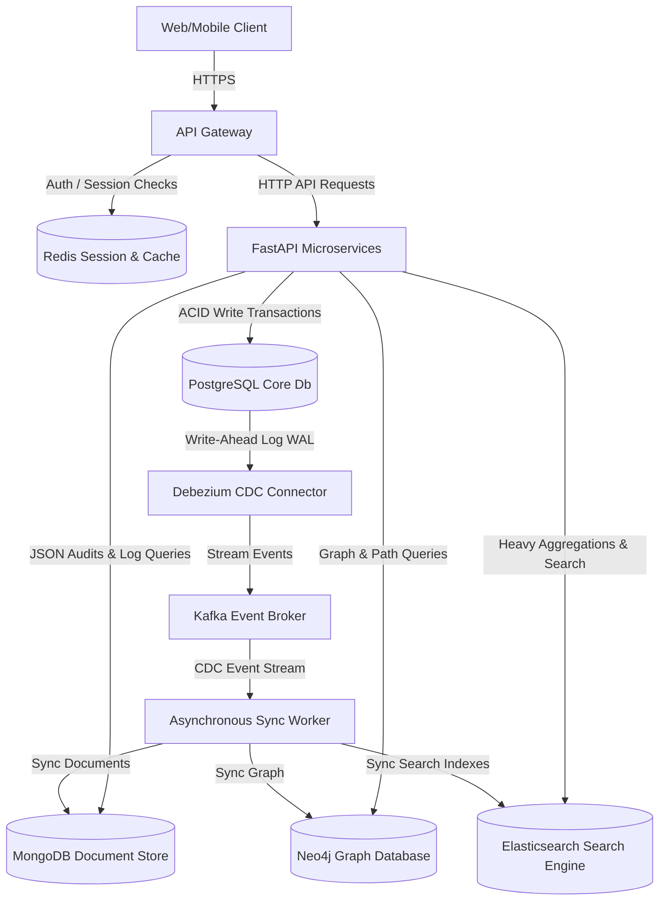
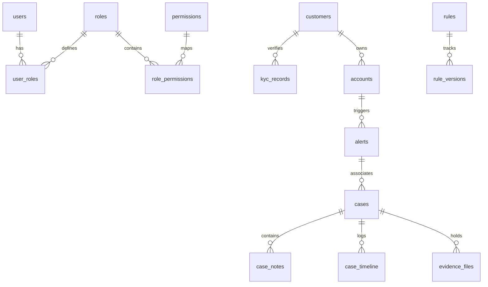
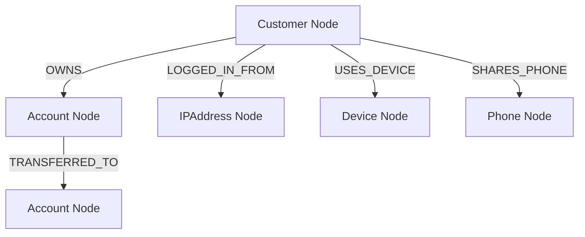

# MuleShield AI - Database Architecture Blueprint
**Enterprise-Grade Banking Data Platform Design**

---

## 1. System Topology & Data Platform Architecture

MuleShield AI leverages a **Polyglot Persistence Model** to handle the distinct processing demands of a real-time money mule, AML, and fraud detection platform. Rather than forcing all access patterns into a single database, data is routed to the engine best suited for the workload.



### 1.1 Storage Tier Breakdown

| Database | Primary Role | Core Access Pattern | Isolation & Scaling |
| :--- | :--- | :--- | :--- |
| **PostgreSQL 15+** | Relational Source-of-Truth | Users, Roles, Customer KYC, Bank Accounts, Audit Logs, Rules, Cases | High ACID consistency, read-replicas, row-level partitioning for audit/timeline tables |
| **MongoDB 6.0+** | Semi-Structured Document Store | High-frequency Ledger Transactions, Device/Browser Fingerprints, Log Events | Sharded cluster by `customer_id` / `created_at` range, automatic TTL index purges |
| **Neo4j 5.9+** | Directed Graph Database | Money Flow Network, Link Analysis, Shares Device/Phone/IP anomalies | Bolt async sessions, causal clustering, graph algorithm execution |
| **Redis 7.0+** | In-Memory Cache & Lock Manager | JWT Session Blacklist, Rate Limiting, Temporary TOTP keys, Dashboard metrics | Sentinel high-availability, clustered, transaction pipelines |
| **Elasticsearch 8.8+** | Full-Text Search Engine | Global search across accounts, customers, cases, transactions, alerts | Distributed indexing, custom tokenizers, fuzzy match configurations |

---

## 2. Cross-Database Synchronization Pipeline

To prevent transaction locks and maintain sub-second response times, data replication is decoupled from the primary HTTP thread via **Change Data Capture (CDC)**.

### 2.1 Transactional Outbox vs. WAL-Based CDC
Instead of relying on application-level multi-database writes (which introduce distributed transaction risks and write latency), we implement WAL-Based CDC:
1. Application writes exclusively to **PostgreSQL**.
2. **Debezium** tail-reads PostgreSQL’s `pglogical` / `decoderbufs` Write-Ahead Logs (WAL) statelessly.
3. Debezium publishes events to **Kafka** topics partition-keyed by the primary UUID.
4. Downstream **Sync Workers** consume from Kafka, transforming relational rows into target shapes for MongoDB documents, Neo4j graph nodes, and Elasticsearch search index payloads.

---

## 3. PostgreSQL Database Architecture

PostgreSQL represents the relational backbone of the platform, enforcing strict database-level constraints.



### 3.1 Naming and Architectural Conventions
- **Identifiers**: All table primary keys use `UUIDv4` instead of sequential integers to mitigate enumeration attacks.
- **Audit Columns**: Every table maintains `created_at TIMESTAMPTZ`, `updated_at TIMESTAMPTZ`, `created_by UUID`, `updated_by UUID`, and a `version INT` column to support optimistic locking.
- **Soft Delete**: Tables subject to legal retention regulations (Users, Accounts, Cases) use a `deleted_at TIMESTAMPTZ` column. Standard query sessions filter where `deleted_at IS NULL`.
- **Partitioning**: 
  - `audit_logs` and `case_timeline` tables are partitioned by **RANGE** on the `created_at` timestamp.
  - Partitions are allocated monthly. Older partitions (older than 7 years) are archived dynamically to cold storage.

---

## 4. MongoDB Document Topologies

MongoDB stores high-velocity, semi-structured events.

### 4.1 Schema Validation & Collections

#### Collection: `transactions`
Contains transaction ledgers, browser headers, and locations.
```json
{
  "$jsonSchema": {
    "bsonType": "object",
    "required": ["transaction_id", "source_account_id", "destination_account_id", "amount", "currency", "device_fingerprint", "location"],
    "properties": {
      "transaction_id": { "bsonType": "string" },
      "source_account_id": { "bsonType": "string" },
      "destination_account_id": { "bsonType": "string" },
      "amount": { "bsonType": "decimal" },
      "currency": { "bsonType": "string", "pattern": "^[A-Z]{3}$" },
      "device_fingerprint": {
        "bsonType": "object",
        "required": ["device_hash", "os", "ip_address"],
        "properties": {
          "device_hash": { "bsonType": "string" },
          "os": { "bsonType": "string" },
          "ip_address": { "bsonType": "string" }
        }
      },
      "location": {
        "bsonType": "object",
        "required": ["latitude", "longitude"],
        "properties": {
          "latitude": { "bsonType": "double" },
          "longitude": { "bsonType": "double" }
        }
      },
      "created_at": { "bsonType": "date" }
    }
  }
}
```

### 4.2 Indexing & TTL Policies
- **Transactions Compound Index**: `{ source_account_id: 1, created_at: -1 }` for rapid history fetches.
- **Device Hash Index**: `{ "device_fingerprint.device_hash": 1 }`.
- **TTL Index**: A TTL index is configured on the `login_events` and `behaviour_events` collections to automatically purge logs after 90 days:
  ```javascript
  db.login_events.createIndex({ "created_at": 1 }, { expireAfterSeconds: 7776000 })
  ```
- **Sharding Strategy**:
  - `transactions` collection is sharded by **Hashed Partitioning** on `source_account_id` to distribute write operations evenly across cluster shards.

---

## 5. Neo4j Graph Ontology & Cypher Schemas

Neo4j models structural linkages between accounts, customers, devices, and addresses to detect cyclic money flow (money mules) and account takeovers.



### 5.1 Node Labels & Properties
- **Customer**: `id` (UUID), `risk_score` (Float), `kyc_status` (String).
- **Account**: `id` (UUID), `account_number` (String), `status` (String).
- **Device**: `device_hash` (String), `os` (String).
- **IPAddress**: `ip_address` (String), `country` (String).

### 5.2 Unique Constraints
Enforces unique boundaries at graph entry points:
```cypher
CREATE CONSTRAINT customer_id_unique FOR (c:Customer) REQUIRE c.id IS UNIQUE;
CREATE CONSTRAINT account_number_unique FOR (a:Account) REQUIRE a.account_number IS UNIQUE;
CREATE CONSTRAINT device_hash_unique FOR (d:Device) REQUIRE d.device_hash IS UNIQUE;
```

### 5.3 Graph Algorithms (Cypher Specs)
- **Shortest Path (Money Routing detection)**:
  ```cypher
  MATCH (start:Account {account_number: $src}), (end:Account {account_number: $dest})
  MATCH path = shortestPath((start)-[:TRANSFERRED_TO*..10]->(end))
  RETURN path
  ```
- **Shared Device Mule Clusters**:
  Detects accounts linked to different customers logging in from the exact same device:
  ```cypher
  MATCH (c1:Customer)-[:USES_DEVICE]->(d:Device)<-[:USES_DEVICE]-(c2:Customer)
  WHERE c1.id <> c2.id
  RETURN d.device_hash, collect(distinct c1.id) AS linked_customers, count(c2) AS density
  ```

---

## 6. Redis Memory Layout & Keyspace Standards

Redis manages in-memory states using strict prefixing standards: `muleshield:{service}:{purpose}:{key}`.

| Purpose | Key Pattern | Data Structure | TTL |
| :--- | :--- | :--- | :--- |
| **JWT Blacklist** | `muleshield:auth:blacklist:{jti}` | String (`"revoked"`) | Match remaining JWT lifespan |
| **API Rate Limiter** | `muleshield:gateway:ratelimit:{ip}:{minute_timestamp}` | String (integer increment) | 60 seconds |
| **Temporary TOTP Secret** | `muleshield:auth:mfa:temp:{user_id}` | String | 10 minutes |
| **Distributed Lock** | `muleshield:lock:{account_id}` | String (UUID token) | 5 seconds (lock renewal) |

---

## 7. Elasticsearch Indexes and Mappings

Elasticsearch enables fuzzy matching and full-text searches.

### 7.1 Mappings Schema for `customers`
```json
{
  "mappings": {
    "properties": {
      "customer_id": { "type": "keyword" },
      "first_name": { 
        "type": "text",
        "analyzer": "standard",
        "fields": {
          "suggest": { "type": "completion" }
        }
      },
      "last_name": { 
        "type": "text",
        "analyzer": "standard",
        "fields": {
          "suggest": { "type": "completion" }
        }
      },
      "email": { "type": "keyword" },
      "phone": { "type": "keyword" },
      "kyc_status": { "type": "keyword" },
      "risk_score": { "type": "float" },
      "created_at": { "type": "date" }
    }
  }
}
```

---

## 8. Cross-Database Synchronization Details

When a transaction occurs:
1. `account-service` writes the transaction ledger to Postgres and updates Postgres account balances within a standard ACID database transaction block.
2. Debezium captures the inserts in the Postgres tables.
3. Debezium publishes change events to the `muleshield.postgres.transactions` Kafka topic.
4. Downstream Sync Workers:
   - Consumer A maps row inserts into the MongoDB `transactions` collection.
   - Consumer B executes a Cypher write query:
     ```cypher
     MERGE (src:Account {id: $source_account_id})
     MERGE (dest:Account {id: $destination_account_id})
     CREATE (src)-[:TRANSFERRED_TO {amount: $amount, timestamp: $created_at}]->(dest)
     ```
   - Consumer C posts the document details to the Elasticsearch `transactions` index.
5. In-Memory states (like the transaction velocity rate filters) update in Redis using pipelines.
